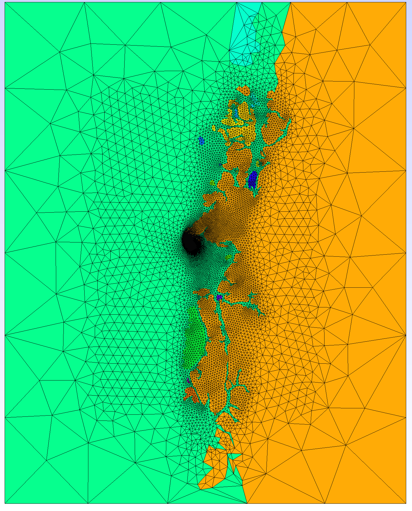

# Manual of TMTGEM v1.3
## Takuto Minami’s Tsunami-Generated Electro-Magnetic simulation code

#### As of Nov 11, 2023

Takuto MINAMI
tminami@port.kobe-u.ac.jp
(Faculty of Science, Kobe University)

### Contents

1. [Introduction](#Introduction) 
2. [Important notes](#ImportantNotes)
3. [Required environments](#Required_environments)
4. [Run sample simulations](#Run_sample_simulations)  
4.1. [Preparation for running sample simulation in Tohoku/em/](#Preparation)
 - Sample 1: [Tohoku (small mesh)](#Tohoku_small)
 - Sample 2: [Easter Island](#Easter)
 - Sample 3: [Chile](#Chile)
 - Sample 4: [Mediterranean](#Mediterranean)

5. [Details of the code](#Details_of_code)  
5.1. [Mesh generation part](#Meshgeneration)  
5.2.  [Time domain simulation part](#Time-domain-simulation)
6. [Output files of TMTGEM](#Output_files)
7. [Release notes](#Release_notes)
8. [Question and comments are welcome!!](#Questions)
9. [References](#References)

## 1 Introduction 
TMTGEM is a simulation code for calculating tsunami-generated electromagnetic fields via electromotive force in the ocean. TMTGEM is written in fortran and uses intel-math-kernel library (mkl) for the use of a sparse direct solver, PARDISO. TMTGEM can use openMP for parallel computation with PARDISO, which is suitable for time-domain computing because only one factorization is necessary for one simulation. 
TMTGEM is composed of two parts: 1: Mesh generation part, 2: Simulation part. TMTGEM is currently assume to use the output of [COMCOT tsunami simulation code](http://223.4.213.26/archive/tsunami/cornell/comcot_down.htm). Sample code includes COMCOT ver 1.7 with modification by [Kawashima and Toh (2016)](#KT2016).
TMTGEM uses [Gmsh](https://www.soest.hawaii.edu/gmt/) for mesh generation and the extrude algorithm described in [Oishi et al. (2013)](#O2013). Most of the subroutines for extrusion are from a fluid simulation open-source code, [Fluidity](http://fluidityproject.github.io/). 
	

## 2 Important notes 
Coordinate system: X: eastward, Y: northward, Z: upward in TMTGEM
Solved equations: Refer to Minami et al. (2017, JGR) 
TMTGEM : assumes topo data lon [deg], lat [deg], alt [m, downward positive]

## 3 Required environment 
Please make the following packages installed in your PC
[Gmsh](http://gmsh.info/) for mesh generation
Intel fortran compiler with mkl library (confirm you can use “ifort –mkl=parallel ***”)
GMT ([generic mapping tool](https://www.soest.hawaii.edu/gmt/)) for vieweing simulation results
ghostscript (only for “gv” commands, e.g. in plot_z.sh in TMTGEM/Tohoku/flow)

### Required data set
Bathymetry data: please download xyz data from https://topex.ucsd.edu/WWW_html/mar_topo.html
But downward positive bathymetry data is assumed for COMCOT and TMTGEM
Please use, e.g. TMTGEM/Tohoku/topo/mktopo.sh, to change altitude signs.
(Optional) Conductivity data: You can use ocean conductivity data by downloading
(Optional) Background Earth’s magnetic field data

## 4 Run sample codes 
Run TMTGEM anyway!! 
In the home folder of TMTGEM/, four folders, Tohoku/, Chile/, Mediterranean/, and Easter/, are those for example simulations. Rough run time is listed in Table 1.

Table 1. Overview of sample simulations and required time

TMTGEM/

|Command	| Tohoku/    |Tohoku/  | Tohoku/ |Tohoku/ | Easter/ | Chile/ | Mediterranean/ | 
|:----------:|:-----:|:----:|:----:|:----:|:----:|:----:|:----:|
|run_comcot.sh   time |flow/   4m30s| - | - | - | flow/   5m30s| flow/   8m46s  | flow/   8m7s|
|tetmeshgen.sh   time | mesh/   2m15s  | - | - | mesh_large/   15m14s | mesh/   1m43s | mesh/   5m10s | mesh/   3m21s |
|run.sh    time	     | em/   7m52s |	em_IGRF/   8m38s	| em_woa/   8m32s	| em_large/   2.6 hour | em/   7m50s	| em/   7m57s| em/   15m14s |

(“time” is computation time, which was measured by Macbook Pro with 2.8 GHz intel Core i7 with 16 GB RAM, and ./run.sh was performed by 4-thread OpenMP parallel computation. “NX*NY” is the grid configuration for comcot calculation. ”# of lines” indicates the number of lines in a unit of million (M) for the generated 3-D mesh, em3d.msh. )

## 4.0 Preparation for running sample simulation in Tohoku/em/ 
As preparation, tsunami flow data and simulation mesh are necessary for tsunami electromagnetic simulations. Implement the following commands in terminal for preparation:

### run comcot 
	$ cd TMTGEM/Tohoku/flow
    $ ./run_comcot.sh                         (generate tsunami flow data)
### mesh generattion for TMTGEM
	$ ./plot_z.sh 000600                      (check tsunami height, see Fig. 1a)
	$ cd TMTGEM/Tohoku/mesh
	$ ./tetmeshgen.sh                         (mesh generation)
### check generated mesh
	$ gmsh polygonki.msh                      (check generated 2d mesh, see Fig. 1b)
	$ gmsh em3d.msh                           (check generated 3d mesh, see Fig. 1c)

When the preparation is successful, users can see the following figures.

Fig. 1. (a) Tsunami height drawn by “./plot_z.sh 000600” in Tohoku/flow/. (b) 2-D mesh of polygonki.msh drawn by “gmsh polygonki.msh” in Tohoku/mesh/. (c) Final 3-D mesh drawn by “gmsh em3d.msh” in Tohoku/mesh/.

## 4.1 Sample 1: Tohoku 
Sample simulations in Tohoku/em/ with Tohoku/mesh/em3d.msh
There are currently three types of example simulations using a relatively small Tohoku mesh, “Tohoku/mesh/em3d.msh”.

##### Tohoku/em/
 use of homogeneous background magnetic field and given ocean conductivity
##### Tohoku/em_IGRF/
 use of IGRF background magnetic field with homogeneous ocean conductivity
##### Tohoku/em_woa/
 use of homogeneous background magnetic field and heterogeneous ocean conductivity

All the above three samples generate almost the same results for the given short time evolution period of t = 5 min. Please confirm that TMTGEM runs well with several types of control files, e.g. Tohoku/em/tohoku.ctl. In each file, please implement the following commands:

	$ cd TMTGEM/Tohoku/em         (case for Tohoku/em)
	$ ./run.sh                        (run TMTGEM simulation)
### simulation running
	$ ./plotgeomag.sh                 (check the used ambient magnetic field; Fig. 2)
	$ ./plotcond.sh                   (check the used ocean conductivity; Fig. 3)
	$ ./bxyzplot.sh 000060 3          (check 3rd magnetic comp. (Bz) for it = 60; Fig. 4 )
	
Users can see the following figures when sample simulation finished successfully.

 

Fig. 2a. Used geomagnetic main field of (Fx, Fy, Fz) = (0,0,-35000) [nT] (geomag.pdf drawn by ./plotgeomag.sh in Tohoku/em/ or Tohoku/em_woa, after simulations.)

 

Fig. 2b. Case for use of IGRF main fields. (geomag.pdf drawn by ./plotgeomag.sh in Tohoku/em_IGRF).

Fig. 3a. Map of ocean conductivity within tetrahedral elements facing sea surface (surfcond.out) and seafloor (bottcond.out). These figures are drawn by ./plotcond.sh in Tohoku/em/ or Tohoku/em_IGRF.
 

Fig. 3b. Map of ocean conductivity within tetrahedral elements facing sea surface (top row) and seafloor (bottom row). These figures are drawn by ./plotcond.sh in Tohoku/em_woa after simulation. Left column show the map calculated from the original 1 by 1 degree grid ocean conductivity data, woa13_decav81B0_C00an01.csv (Tyler et al., 2017) (“_wocomp” stands for “w/o complementation”). The right column shows the complemented ocean conductivity map for the TMTGEM simulation. In the left column, the empty bins are filled with a given default seawater conductivity of 3.3 S/m.

Fig. 4. Result of “./bxyzplot.sh 000060 3” in Tohoku/em after simulation. The black contour lines indicate the same amplitude of the horizontal particle velocity. Note that almost the same results come out in smaple1/em_IGRF and Tohoku/em_woa at it = 000060.

Fig. 6 Vertical component of tsunami-generated magnetic field, drawn by “./bxyzplot.sh 000060 3” (left) and the surface conductivity drawn by ./plotcond.sh in Tohoku/em_large.
 

Figure 7. The upward component of IGRF magnetic field, drawn by ./plotgeomag.sh in Tohoku/em_large. Note that IGRF fields are calculated only in the area for COMCOT calculation.

## 4.2 Sample 2: Easter Island
TMTGEM can deal with isolated island in open ocean.  Procedure for running sample simulation is the same as Section 4.0 and 4.1. Conduct the following three commands:
in TMTGEM/Easter/flow/

	$./run_comcot.sh

in TMTGEM/Easter/mesh/

	$./tetmeshgen.sh

in TMTGEM/Easter/em/

	$./run.sh

Results are as follows:

Figure 8. polygonki.msh generated by tetmeshgen.sh, drawn by $gmsh polygonki.msh in Easter/mesh/.

Figure 9. Result for sea surface deformation of the comcot simulation, drawn by $./plot_z.sh 000600 in Easter/flow.
 

Figure 10. (a) Vertical component of tsunami magnetic field, drawn by “./bxyaplot.sh 000060 3”. The black contour is |vh|, and green contour means the ocean depth of 2800 m. (b) Fz from IGRF model, drawn by “./plotgeomag.sh”. (c) The vertically integrated total electric current in the ocean, drawn by “./ixyhplot_xy.sh 000060”, where the black contour is the same as (a) and arrows indicate directions of electric current. (d) Ocean surface conductivity, drawn by “./plotcond.sh”. (a) – (d) figures were made in TMTGEM/Easter/em.

## 4.3 Sample 3: Chile
TMTGEM newly became capable of dealing with topography area whose top right corner is in land. In the same manner as the previous samples, one can obtain the results in the following procedure:

in TMTGEM/Chile/flow/

	$./run_comcot.sh

in TMTGEM/Chile/mesh/

	$./tetmeshgen.sh

in TMTGEM/Chile/em/

	$./run.sh

Results are as follows:

 

Figure 11. polygonki.msh and em3d.msh generated by tetmeshgen.sh, drawn by “$gmsh polygonki.msh” and “$gmsh em3d.msh” in Chile/mesh/.

 Figure 12. Results of the comcot simulations, drawn by 
 $./plot_z.sh 000300”
 and 
 $./plot_z.sh 000600” in Chile/flow.

 
Figure 13. Same as Fig. 10 but for the simulation in Chile/em. For (a) to (d), please conduct “./bxyzplot.sh 000060 3”, “./plotgeomag.sh”, “./ixyhplot_xy.sh 000060”, and “plotcond.sh”, respectively, after “./run.sh” finishes.

## 4.4 Sample 4: Mediterranean
	Modified mesh generator in TMTGEM can robustly work in very complicated bathymetry area as Mediterranean, where many islands and peninsulas are cut by calculation boundaries.

in TMTGEM/Mediterranean/flow/

	$./run_comcot.sh

in TMTGEM/ Mediterranean /mesh/

	$./tetmeshgen.sh

in TMTGEM/ Mediterranean /em/

	$./run.sh

Results are as follows:

 

Figure 14. Generated meshes by ./tetemeshgen.sh, drawn by, in Mediterranean/mesh,

	$gmsh polygonki.msh 

and 

	$gmsh em3d.msh” 
 

Figure 15. Results of comcot simulation drawn by “./plot_z.sh 000600” in Mediterranean/flow/.
 

Figure 16. Result for Mediterranean/em. The figure formats are the same as Fig. 10. Note in (b) and (d) that values are reasonable within the black rectangle area that corresponds to the comcot calculation area.
 Vertical component of tsunami-generated magnetic field, drawn by “./bxyaplot.sh 000060 3” (left), Fz from IGRF drawn by 

	$./plotgeomag.sh (center) 
	
and surface conductivity drawn by in Mediterranean/em

	$./plotcond.sh

## 5. Details of the code 
## 5.1 Mesh generation part
The most important and difficult part in TMTGEM is to generate appropriate tetrahedral mesh for tsunami EM simulations. A rough mesh generation flow is as follows, all of which is in tetmeshgen.sh in each mesh generation folder, e.g. Tohoku/mesh:

Generate 2-D triangle mesh
Read bathymetry data and reflect it in triangular mesh
Extrude the surface triangle to the seafloor to generate ocean 3-D mesh (mesh1)
Generate 3-D tetrahedral mesh for air and solid earth (mesh2)
Combine mesh 1 and mesh2 for 3-D EM simulation

Read Fig. 1 in Minami et al. (2017) for understanding the flow.

< Important output files by tetmeshgen.sh >
*.geo : geometry files (use gmsh to view)
polygonki.msh : 2-D triangular mesh for ground/ocean surface (use gmsh to view)
ocean.msh : 3-D tetrahedral mesh only for ocean layer (use gmsh to view)
pre3d.msh : 3-D tetrahedral mesh only for air and solid earth (use gmsh to view)
em3d.msh : final 3-D tetrahedral mesh for tsunami EM simulation (use gmsh to view)
lineinfo.dat : line data for em3d.msh

View of output meshes (use gmsh to view each mesh file)

Fig. 17 Example outputs of tetmeshgen.sh.

All the control parameters for mesh generation are included in a control file, for example Tohoku/mesh/mesh.ctl. See below for the meaning of each parameters in mesh.ctl.
### < mesh.ctl >
    # of header        |3
    ## This control file is generated on Sep 7, 2016, (see m_param_mesh.f90)
    ## It is confirmed that this control file works well
    --------10--------20--------------------------------
    topofile           |../topo/W120E176S20N60_1min.xyz input topofile
    west bound  [deg]  | 140.0   see Fig. 8
    east bound  [deg]  | 148.0   see Fig. 8 
    south bound [deg]  | 34.0    see Fig. 8
    north bound [deg]  | 42.0    see Fig. 8
    nmcal lower bnd[km]| -500.0  see Fig. 10
    nmcal upper bnd[km]| 1000.0  see Fig. 10
    sizein  [km]       |20.0     see Fig. 8
    sizeout [km]       |100.0    see Fig. 8
    sizecoastratio [km]|0.3      see Fig. 9
    lenout  [km]       |300.0    see Fig. 8
    # of observatories |2        # of observatory where you need fine mesh
    name of obs        |ESA      Name of Obs
    lon,lat[deg]alt[km]|141.35472       39.236944      0.0(Alt is not used)
    name of obs        |b14
    lon,lat[deg]alt[km]|144.807595      39.0582       -5.380 (format g15.7)
    reso at obs [km]   |1.0      see Fig. 8
    sigma forGauss [km]|50.0     see Fig. 8
    0:none,1:vres<hres |0        set 0 anyway
    # of max layers    |3        see Fig. 11
    nlayer=1 up to [km]|-0.3     see Fig. 11
    nlayer=2 up to [km]|-2.0     see Fig. 11
    header             |polygon  you may change but “polygon” is safe
    bgmesh: upzin  [km]|20.0
    bgmesh: downzin[km]|-20.0
    bgmesh:sizein3d[km]|14.0        
    Here are parameters for bgmesh3d.pos, which are not used for now.

Please set as they are.

## < How to control 2-D triangular mesh >
 
polygonki.msh
Fig. 8 Meanings of mesh generation parameters.
	How to control the mesh seizes along coastlines (use “coastratio”)
 
polygonki.msh
Fig. 9. Meaning of parameters for resolution along coastlines.

	How to set upper and lower boundaries for em3d.msh  (use “nmcal upper bnd” and “nmcal lower bnd”)

 
pre3d.geo
Fig. 10. Structure of 3-D mesh.

	How to control the number of layers in the ocean dependent on the ocean depth (use “# of max layers” and “nlayer=* up to [km]” )
 
< vertical section of em3d.msh >
Fig. 11. Parameters controlling the number of layers in the ocean.

Note: Use of background mesh “bgmesh3d.pos” is not available for now.

## 5.2 Time-domain simulation part
	Control parameter is for simulation part, e.g. Tohoku/em_large/tohoku.ctl, is as follows:

< TMTGEM/Tohoku/em_large/tohoku.ctl >

	--------10--------20--------------------
	1:err,2:fwd,3:both |2  1: div error calculation, 2: normal forward
	3d em mesh file    |../mesh_large/em3d.msh       <- mesh info
	line infro file    |../mesh_large/lineinfo.dat   <- mesh info
	mesh control file  |../mesh_large/mesh.ctl       <- mesh info
	ocean mesh file    |../mesh_large/ocean.msh      <- mesh info
	start time [sec]   |0.0                          <- starting time
	time interval [sec]|5.0                          <- time interval for EM simulation
	end time   [sec]   |300.0                        <- end time of EM simulation
	1:COMCOT,2:analytic|1                            <- input is COMCOT or analytic velocity field
	xgrid file         |../flow/layer01_x.dat        <- COMCOT lon grid file
	ygrid file         |../flow/layer01_y.dat        <- COMCOT lat grid file
	depth grid  file   |../flow/layer01.dat          <- COMCOT depth grid file
	header for m file  |../flow/m_01_                <- COMCOT input file header
	header for n file  |../flow/n_01_                <- COMCOT input file header
	t int COMCOT [sec] |5.0                          <- time interval of COMCOT input
	1:vh,2:vz,3:vh+vz  |1                            <- which component is used for input velocity
	0:IGRF,1:FIL,2:cons|0                            <- choice for ambient magnetic field
	Decimal year       |2011.0                       <- when IGRF, chose the time by decimal year
	xgrid file         |../flow/layer01_x.dat        <- lon grid where IGRF is given
	ygrid file         |../flow/layer01_y.dat        <- lat grid where IGRF is given
	out folder  (bxyz) |./bxyz/                      <- magnetic field output folder
	out folder  (exyz) |./exyz/                      <- electric field output folder
	out folder  (vxyz) |./vxyz/                      <- velocity field output folder
	# of observatories |2                            <- Number of stations where time series are obtained
	1:lonlath,2:xyz[km]|1                            <- lon lat or xyz coordinate selection
	obs name           |ESA                          <- Name  of station
	obs position [km]  |141.35472      39.236944        0.0           <- position 3g15.7
	obs name           |b14
	obs position [km]  |144.807595     39.0582          -5.380        <- position 3g15.7
	0:no,1:nxny,2:seafl|1   plan view option: 1:gridded, 2: every triangles 
	nx, ny             |400         400                               <- Number of grid points in x, y direction
	time interval [sec]|60.0                                          <- stime internal for plan view output
	1:same dpth,2:seafl|2                            <- z for plan view 1:same depth, 2: at seafloor
	nx,ny-> kimsh file |../mesh_large/polygonki.msh  <- mesh info for plan view
	nx,ny->ki23dptr fl |../mesh_large/ki23dptr.dat   <- mesh info for plan view
	# of cond from top |3      
	air cond   [S/m]   |1.e-8 air cond
	ocean cond [S/m]   |3.3   sea water cond (default value)
	crust cond [S/m]   |0.01  crust/mantle cond
	1:no,2:ocecond file|2     1 for homogeneous, 2: from file
	need woa csv file  |../../woa/woa13_decav81B0_C00an01.csv seawater cond

Some options may not work. Please check source programs when behaviors are weird.

# 5.3 Output files of TMTGEM 
1)  ### "bxyz/[Site Name]_bxyz_ts.dat"
	If you set “# of observatories” > 0 and set “obs name” and the obs positions, you will get time series of magnetic field and electric field in ./bxyz/ and ./exyz/ respectively with default setting of output folders. The 4-column format of the magnetic time series file is:
	Time [sec],  bx [nT], by [nT], bz [nT] 
	Note here that bx, by and bz are eastward, northward, upward components of the tsunami-generated magnetic field, respectively.

2) ### "exyz/[Site Name]_exyz_ts.dat"
	Similar to bxyz/[Site Name]_bxyz_ts.dat, you can also get the electric field from TMTGEM run at every observation site. The 10-column format is:

	Time [sec], [x,y,z components of e], [those of v×F], [those of e+v×F]
 
	Here, e is the induced electric field, v×F is the inducing electromotive force, e+v×F is the total electric field to be observed by instruments. All the values are in the unit of [μV/m]The direction of x,y,z components are the same as [Site Name]_bxyz_ts.dat

3) ### "bxyz/bxyz_xy2D******.dat"  (with coord_xy2D.dat)  
	If you use “plan view option” with 1 or 2, you can get output files for plan view of simulated magnet variation. The files named by bxyz_xy2D*****.dat are saved every “time interval [sec]” in bxyz/ folder. ******* indicates the iteration step, then the file corresponds to the snapshot for t=****** × “time interval [sec]”. The file format is 3 column:

	bx [nT], by [nT], bz[nT]

	The location for each row corresponds to the file, “bxyz/coord_xy2D.dat”, the format of which is :

	Number of grid points calculated from (nx * ny)

	X [km], Y [km], Z [km] 

	Here, X,Y,Z are the eastward, northward distances, and elevation based on sea level.

4) ### "exyz/ixyh_xy2D******.dat" (with coord_xy2D.dat)
	The output files for total electric current density $$i_H h=∫σ[e_H+(v×F)_H]dz$$ that is vertically integrated in the ocean layer. The unit of the value is [μA\/m^2×km]=[A/km].The 2-column format is:

	$ih_x$ (A/km), $ih_y$ (A/km)

	The number of lines in the file is nx * ny based on , nx and ny, similar to bxyz/bxyz_xy2D******.dat. ih_x and ih_y are the eastward and northward components of i_H h, respectively.

# 6. Release notes 
### Version 1.3 (Dec 10, 2021)
New parameter “nalyer” is added in solver/m_param.f90. More than one layer from comcot can be used in one simulation. Users can change # of layers at the line 12 in the control file to increase the layers in nested grid in comcot simulation. See Tohoku/em_2layer for example simulation.

### Version 1.2.3 (July 26, 2021)
tmtgem/mesh/combine3d.f90 is modified to reflect more than 2 volumes in pre3d.msh to generate em3d.msh.

### Version 1.2.2 (May 31, 2021)
Bugs in mk3dgeo.f90 are fixed, where [2]make n3d [3] calzkiinland are arranged in the appropriate order. A part of he shell scripts in Tohoku/ are adjusted to gmt 6.

### Version 1.2.1 (May 24th, 2021)
The shell scripts including gmt in Easter, Chile, and Mediterranean sample folders are updated for GMT6.

### Version 1.2 (Aug 5th, 2020)
Bugs in the tmtgem/mesh/m_intersection.f90 and m_coastline.f90 are fixed in TIARES example in Aug 5th, 2020.

### Version 1.1
From ver 1.0 to ver 1.1, a new module was integrated to correct intersections as shown in Fig.12. Currently, this kind of intersections are automatically avoided by tmtgem/mesh/coastline.exe through intersection modules (see mesh/m_intersection.f90).
From ver 1.0 to ver 1.1, no significant differences were made in the solver part in tmtgem/solver/*.

Fig. 22. Intersection occurrence in polygonki.geo. (Visualized by “gmsh polygonki.geo”)

# 7 Questions and comments are welcome!!
Please send messages to takuto.minami126@gmail.com when you face any difficulties while running TMTGEM. There should be many remaining bugs and this manual is not well written. I can revise this manual by reflecting your questions and comments, which can help other users. 

# 8 References 

- Kawashima, I., & Toh, H. (2016). Tsunami-generated magnetic fields may constrain focal mechanisms of earthquakes. Scientific reports, 6, 28603.

- Minami, T., Toh, H., Ichihara, H., & Kawashima, I. (2017). Three‐Dimensional Time Domain Simulation of Tsunami‐Generated Electromagnetic Fields: Application to the 2011 Tohoku Earthquake Tsunami. Journal of Geophysical Research: Solid Earth, 122(12), 9559-9579. 

- Oishi, Y., Piggott, M. D., Maeda, T., Kramer, S. C., Collins, G. S., Tsushima, H., & Furumura, T. (2013). Three‐dimensional tsunami propagation simulations using an unstructured mesh finite element model. Journal of Geophysical Research: Solid Earth, 118(6), 2998-3018.

- Tyler, R. H., Boyer, T. P., Minami, T., Zweng, M. M., & Reagan, J. R. (2017). Electrical conductivity of the global ocean. Earth, Planets and Space, 69(1), 156. 
 

# Appendix A: Derivation of discretized form of the governing equation

Given the governing equation,

$$ \nabla \times \nabla \times \mathbf{A} + \mu \sigma \frac{\partial \mathbf{A}}{\partial t} = \mu \sigma (\mathbf{v} \times \mathbf{B}_0)$$ 

in the finite element method with the Galerkin method, we numerically solve

$$ \int_\Omega \left[ w\cdot \left( \nabla \times \nabla \times \mathbf{A} + \mu \sigma \frac{\partial \mathbf{A}}{\partial t}\right)-\mu \sigma (\mathbf{v}\times \mathbf{B}_0)\right]dV=0 $$
where w is arbitrary test function, where the edge-basis function is adopted for w in the Galerkin method, and Ω is the computational domain.
By using the relationship $$\nabla \cdot ( \mathbf{A}\times \mathbf{B} ) = \mathbf{B}⋅(\nabla \times \mathbf{A} ) -\mathbf{A}\cdot \left( \nabla \times \mathbf{B} \right)$$, the first term in the left hand side of Eq. (1) is reduced to
$$ \int_\Omega { \mathbf{w} \cdot ( ∇ × ∇ × \mathbf{A} ) dV } = \int_\Omega { ∇ \cdot \left( ∇ \times \mathbf{A} \right) × \mathbf{w} } + \left( ∇ × \mathbf{w} \right) \cdot (∇×A) dV $$
$$ = \int_\Omega {∇⋅((∇×A)×w)+(∇×w)⋅(∇×A)}dV$$
$$=\int_{\partial \Omega } \left[ ((∇×\mathbf{A})×\mathbf{w})\cdot \mathbf{n}dS \right] + \int_\Omega {(∇ × \mathbf{w}) \cdot (∇ × \mathbf{A}) }dV $$
$$= \int_{\partial \Omega} [(B×w)⋅ndS] +  ∫_\Omega  ( \nabla × \mathbf{w}) \cdot  (\nabla \times \mathbf{A} ) dV ⋅⋅⋅(2) $$
Where $B=∇×A $ represents the magnetic field and $∂Ω$ indicates the boundary surface of the computational domain, and $n$ is a outward unit vector normal to the surface ∂Ω. Taking into account that at ∂Ω,we can take
$n⋅(B×w)=w⋅(n×B)=0$,
where $∇⋅(n×B)=B⋅(∇×n)-n⋅(∇×B)=-n⋅(μj)=0$ indicates there are no electric current penetrating the boundary surface. Then, Eq. (2) reduces to
$$ ∫_Ω[w⋅(∇×∇×A)dV]=∫_Ω{(∇×w)⋅(∇×A)}dV⋅⋅⋅(3)$$
Substituting Eq. (3) into Eq. (1), we obtain
$$ \int_\Omega {(\nabla \times \mathbf{w})\cdot (\nabla \times \mathbf{A})}dV+∫_Ω[μσw⋅∂A/∂t dV]=μσ\int_\Omega\left[ w⋅(v\times B_0)dV \right].⋅⋅⋅(4)$$
In the finite element method, we divide the numerical domain into finite number of the tetrahedrons and calculate the volume integral for each tetrahedral element. In the remaining, we think only an volume integral for e-th element, Ω_e, then Eq. (4) is rewritten for e-th element as
$$ ∫_{Ω_e} {(∇×w_i )⋅(∇×A_e )}dV+∫_{Ω_e} \left[μσw_i⋅\frac{\partial A_e}{\partial t} dV \right] =μσ∫_{Ω_e}[w_i⋅(v×B_0)dV]⋅⋅⋅(5)$$
where $w_i  (i=1,⋅⋅⋅,6)$ is the edge-basis function for each edge of the e-th tetrahedron. We represent the vector potential in the e-th element as
$$ A_e=∑_{j=1}^6 \left[ w_j  [Al]_j \right]⋅⋅⋅⋅(6)$$
wehre
$$ w_j=w_{kl}=λ_k ∇λ_l-λ_l ∇λ_k $$
$λ_k$ is the nodal basis function. The relationship between $j$ and $k$,$l$ are shown in the following figure and table.
 
#### Table. A1. Node indices for edge index $i$,$j$ 
|i, j (edge id) |	k|	l|	m|	n |
|--|:--:|--  |--| -- |
|1|	1|	2|	3|	4|
|2|	2|	3|	1|	4|
|3|	1|	3|	4|	2|
|4|	1|	4|	2|	3|
|5|	2|	4|	3|	1|
|6|	3|	4|	1|	2|
||||||||

Table A1
Using Eq. (6), Eq. (5) can be reduced to

$$ ∑_{j=1}^6 \left[ ∫_{Ω_e} {(∇×w_i )⋅(∇×w_j )}dV [Al]_j \right] + ∑_{j=1}^6 \left[ ∫_{Ω_e}[μσw_i⋅w_j] dV \frac{d}{dt} [Al]_j \right] = μσ_e ∫_{Ω_e} [w_i⋅(v×B_0)dV]⋅⋅⋅(7)$$

which is rewritten in the matrix form as,

$$[M_e ]+μσ_e [N_e ]  \frac{d}{dt} [Al]_e =s_e ⋅⋅⋅(8)$$

$$ [Al]_e =[[Al]_1  [Al]_2  [Al]_3  [Al]_4  [Al]_5  [Al]_6 ]^T⋅⋅⋅(9)$$
$$[M_e ]_{ij}=∫_{Ω_e}{(∇×w_i )⋅(∇×w_j )}dV=1/3v x_mn⋅1/3v x_{m'n'}×v=1/9v x_mn⋅x_{m'n'}⋅⋅⋅(10)$$
$$[N_e ]_{ij}=∫_{Ω_e}[w_i⋅w_j dV]=∫_{Ω_e}[(λ_k ∇λ_l-λ_l ∇λ_k )⋅(λ_{k'} ∇λ_{l'}-λ_{l'} ∇λ_{k'} )dV]$$
$$ =∫_{Ω_e}(λ_k λ_{k'} ∇λ_l⋅∇λ_{l'}-λ_k λ_{l'} ∇λ_l⋅∇λ_{k'}-λ_l λ_{k'} ∇λ_k⋅∇λ_{l'}+λ_l λ_{l'} ∇λ_k⋅∇λ_{k'} )dV$$
$$=∇λ_l⋅∇λ_{l'} ∫_{Ω_e}[λ_k λ_{k'} dV]-∇λ_l⋅∇λ_{k'} ∫_{Ω_e}[λ_k λ_{l'} dV]$$
$$-∇λ_k⋅∇λ_{l'} ∫_{Ω_e}[λ_l λ_{k'} dV]+∇λ_k⋅∇λ_{k'} ∫_{Ω_e}[λ_l λ_{l'} dV]⋅⋅⋅(11)$$
$$[s_e ]_i=μσ_e ∫_{Ω_e}[w_i⋅(v×B_0 )dV]=μσ_e ∫_{Ω_e} [w_i⋅(∑_{j=1}^4[λ_k [v×B_0]_j ])dV] =μσ_e ∑_{m=1}^4[(∫_{Ω_e}[w_i λ_m dV])⋅[v×B_0 ]_m ] $$
$$=μσ_e ∑_{m=1}^4 [(∫_{Ω_e}[(λ_k ∇λ_l-λ_l ∇λ_k ) λ_m dV]) [⋅v×B_0 ]_m ] (12)$$
Here we introduce the backward Euler method for temporal evolution,
$$\frac{\partial u_{n+2}}{\partial t}=\frac{1}{2Δt} (3u_{n+2}-4u_{n+1}+u_n ).⋅⋅⋅(13)$$
Applying Eq. (13) to Eq. (8) leads to
$$ \left[ [M_e ]+\frac{3μσ_e}{2Δt} [N_e ] \right] [[Al]_e ]_{n+2}=\frac{1}{2Δt} [N_e ](4[[Al]_e ]_{n+1}-[[Al]_e ]_n )+[s_e]_{n+2}⋅⋅⋅(14)$$

# Appendix B: Scaling of the governing equation
From eq. (14), the equation to be solved at each time step is rewritten as

$$∑_{j=1}^6 \left[ ∫_{Ω_e}{(∇×w_i )⋅(∇×w_j )dV+\frac{3μσ_e}{2Δt} [∫_{Ω_e}[w_i⋅w_j dV]]} [[Al]_j ]_{n+2} \right]=∑_{j=1}^6[\frac{1}{2Δt} [∫_{Ω_e}[w_i⋅w_j dV]](4[[Al]_j ]_{n+1}-[[Al]_j ]_n ) ]+μσ_e ∑_{m=1}^4[(∫_{Ω_e}[w_i λ_m dV])⋅[v×B_0 ]_m ] .⋅⋅⋅(15)$$

In TMTGEM, scaled form of Eq. (15) is solved using the scaling length L, set to be 1000m in TMTGEM. Consider to rewrite Eq. (17) by using $∇=\frac{1}{L} ∇'$,$w=\frac{1}{L} w'$,$dV=L^3 dV'$, $Al[s⋅V/m⋅m]=∫A⋅dl=\frac{1}{L} Al'$, where $Al'$  [s⋅mV/km⋅km],and $E={\partial A}/{\partial t}$. Furthermore, we assume $v=\frac{1}{L}⋅v'$[mm/s] and $B_0=\frac{1}{L}^3⋅B_0'$  [nT] These replacements correspond to the fact that w and ∇ are constructed as w’ and ∇’ with the coordinate system in the unit of km.

$$∑_{j=1}^6 ∫_{Ω_e}(\frac{1}{L} ∇'×\frac{1}{L} w'_i )⋅(\frac{1}{L} ∇'×\frac{1}{L} w_j') L^3 dV'+\frac{3μσ_e}{2Δt} ∫_{Ω_e}[\frac{1}{L} w_i'⋅\frac{1}{L} [w']_j L^3 dV']]$$

$$  \frac{1}{L}  [[Al' ]_j]_{n+2} ]=∑_{j=1}^6[\frac{1}{2Δt} [∫_{Ω_e}[\frac{1}{L} w_i'⋅\frac{1}{L} [w']_j L^3 dV']](4[\frac{1}{L}  [Al' ]_j]_{n+1}-[\frac{1}{L}  [Al' ]_j]_n )+] μσ_e ∑_{m=1}^4[(∫_{Ω_e}[\frac{1}{L} w_i' λ_m L^3 dV'])⋅[[\frac{1}{L} v'×\frac{1}{L}^3  B_0' ]_m]_{n+2} ] $$

$$⟺∑_{j=1}^6[[∫_{Ω_e}[{(∇'×w_i' )⋅(∇'×w_j' )}dV'+\frac{3μσ_e}{2Δt} L^2 ∫_{Ω_e}[w_i'⋅[w']_j dV']] [Al']_j ]=∑_{j=1}^6[\frac{L^2}{2Δt} [∫_{Ω_e}[w_i'⋅[w']_j dV']](4[[Al']_j]_{n+1}-[Al'_j]_n )+] μσ_e ∑_{m=1}^4[(∫_{Ω_e}[w_i' λ_m dV'])⋅[v'×B_0']_m ] $$

